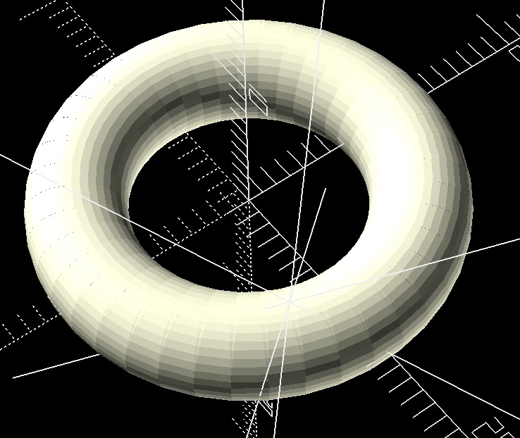

# Life-Saver
Experiment to see how OpenAI to create a familiar shape.

# Overview
This is a collaboration between Ken Evans and Bruce Jenner to see how easy it might be to use OpenAI ChatGPT to create a familiar shape, and print it on a 3D printer. To make this easy we are using OpenSCAD to design the shape, which allows us to work on the shape as simple source code that can easily be communicated with ChatGPT.

The shape chosen was a familiar circular shape with a hole in the middle that a string could pass through to put on a necklace, with some wording on the face. Ken likes to give these away to strangers to let them know they are all friends to him and even small acts of kindness can be a life saver to a another. 

# Iterative Design with ChatGPT
## Simple Query
The first approach was to try a very simple query to see if ChatGPT could create the shape. 

**You**
*print a 3d tilted lifesaver using openscad for the model*

**ChatGPT**
*Creating a 3D model of a tilted lifesaver using OpenSCAD involves writing a script in the OpenSCAD language. Here's an example script to create a simple tilted lifesaver:* 
[Simple Query Life Saver](Simple-Query-Life-Saver.scad)

While this was impressive, it was not everything we wanted.

## Envisioning Something Better Query
The next step was to improve on this by providing some critiques of the simple version and ask for improvements. 

**You**
*Can you do this better. Its not what we envision. A lifesaver should have raised letter for "LIFE SAVER" and there should be a bezel and some rounded parts.*

*Why are there two rings? There should only be one.*

**ChatGPT**
*Certainly, let's refine the OpenSCAD script to better match your vision of a lifesaver with raised letters, a bezel, and rounded parts. I'll also ensure that there's only one ring in the model. Here's an updated script:* 
[Better Life Saver](Better-Life-Saver.scad)

This was not really better at all, just more of the same. 

## Image of Life Saver Query
Having no real success with the current approach, we decided to try something completely different. 

**You**
*Ok. That was lame. Can we scan a picture so you can see what we mean? Or can you use a URL to view it?*

**ChatGPT**
*Yes, you can either upload a picture directly here, or provide me with a URL to view the image. If you choose to upload the picture, I can analyze it directly. If you provide a URL, I can use the browser tool to view the image from the provided link. Once I see the image, I'll have a better understanding of what you're envisioning for the lifesaver design and can offer more accurate guidance or a revised OpenSCAD script.*

Providing an image of what we wanted resulted in this response.

**ChatGPT**
*Based on the image you've provided, the 3D model of a lifesaver candy would have the following characteristics:*

*A toroidal shape with a smooth surface.*
*Raised lettering across the top surface that reads "LIFE SAVERS".*
*The letters are embossed, meaning they protrude above the main surface.*
*The central hole is clean and round, typical of a lifesaver candy.*
*The overall form factor appears to have a consistent thickness throughout its shape.*
*To model this in OpenSCAD, you'll need to use a combination of 3D primitives (like cylinders and toruses) and text extrusion with careful placement and rotation to achieve the raised lettering effect. The model would also need to be designed so that the raised letters follow the curvature of the lifesaver, which can be complex and might require custom functions or modules.*

**You**
*Sure. I can install some openscad plugin. I do have some. Can we try this?*

**ChatGPT**
*Certainly, to model a lifesaver with the details as seen in the image, using an OpenSCAD plugin could be beneficial. Plugins like text_on() or write.scad can help in creating text that follows a curved surface. You would use the linear_extrude function along with the text() function to create the raised letters, and then place them on the curved surface of the torus-shaped lifesaver.*

*Here’s a conceptual example of how you might begin to structure the OpenSCAD code with a plugin:*

This results in the disappointing obvious code block...

>include <text_on.scad>; // Include the plugin
>
>diameter = 100; // Diameter of the lifesaver
>thickness = 20; // Thickness of the ring
>text_height = 5; // Height of the raised text
>
>torus(r1 = diameter / 2, r2 = thickness / 2, $fn=200);
>text_on(torus, "LIFE SAVER", text_height);

## Torus Query
The last query was not really helpful, regressing to simple pseudocode that pushed all the real work into submodules left as an exercise for the reader. After some more coaxing to provide a good module for a torus, ChatGPT identified these. 

**ChatGPT**
*You can find OpenSCAD code for a torus in the repositories by Henrik-Timmer and Sembiance on GitHub. These modules will provide you with a starting point to create a torus shape that you can then customize to add the raised lettering and other specific details for your lifesaver design. To use these modules, you would typically download the .scad file and include it in your OpenSCAD project with the include or use command.*

*Here are the links to the GitHub repositories where you can access the torus modules:*

*Henrik-Timmer's torus module on GitHub: openSCAD_Modules/torus.scad*
*Sembiance's common OpenSCAD code: common/openscad/torus.scad*
*These repositories are open-source and provide the raw .scad code which you can review and integrate into your OpenSCAD projects.*
[Henrik-Timmer torus.scad](https://github.com/Henrik-Timmer/openSCAD_Modules/blob/main/torus.scad)

The torus code is basically this one for loop.
 
>   for (i = [1: fn]){
>   rotate([90,0,360 / fn * i])translate([r1 ,0,0])cylinder(h = 2 * (r1 + r2) * 3.14 / fn,r = r2,center = true,$fn = fn);
>       }

