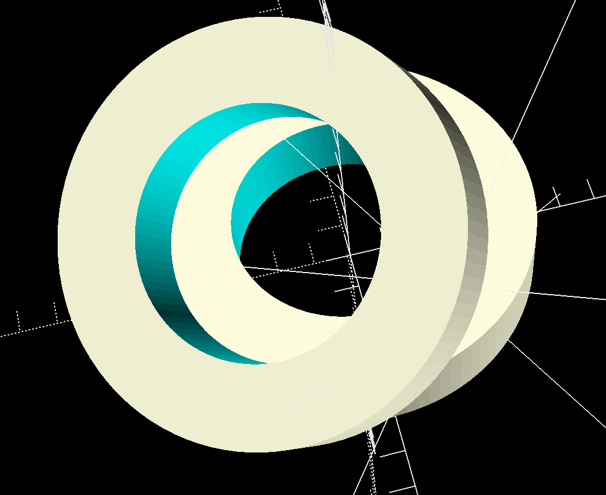
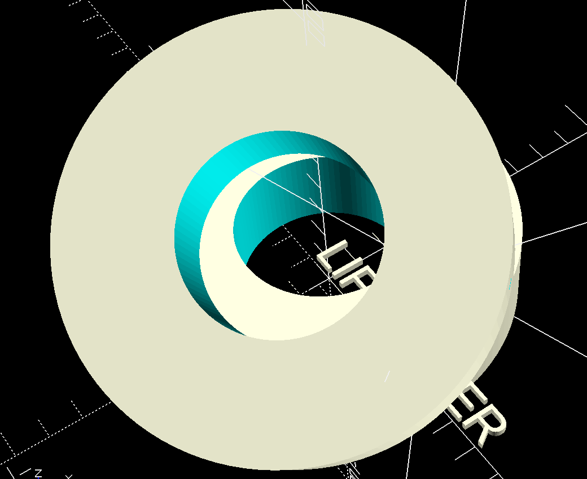

# Life-Saver
Experiment to see how OpenAI to create a familiar shape.

# Overview
This is a collaboration between Ken Evans and Bruce Jenner to see how easy it might be to use OpenAI ChatGPT to create a familiar shape, and print it on a 3D printer. To make this easy we are using OpenSCAD to design the shape, which allows us to work on the shape as simple source code that can easily be communicated with ChatGPT.

The shape chosen was a familiar circular shape with a hole in the middle that a string could pass through to put on a necklace, with some wording on the face. Ken likes to give these away to strangers to let them know they are all friends to him and even small acts of kindness can be a life saver to a another. 

# Simple Query
The first approach was to try a very simple query to see if ChatGPT could create the shape. 

**You**
*print a 3d tilted lifesaver using openscad for the model*

**ChatGPT**
*Creating a 3D model of a tilted lifesaver using OpenSCAD involves writing a script in the OpenSCAD language. Here's an example script to create a simple tilted lifesaver:* 
[Simple Query Life Saver](Simple-Query-Life-Saver.scad)

While this was impressive, it was not everything we wanted.

# Envisioning Something Better
The next step was to improve on this by providing some critiques of the simple version and ask for improvements. 

**You**
*Can you do this better. Its not what we envision. A lifesaver should have raised letter for "LIFE SAVER" and there should be a bezel and some rounded parts.*

*Why are there two rings? There should only be one.*

**ChatGPT**
*Certainly, let's refine the OpenSCAD script to better match your vision of a lifesaver with raised letters, a bezel, and rounded parts. I'll also ensure that there's only one ring in the model. Here's an updated script:* 
[Better Life Saver](Better-Life-Saver.scad)

This was not really better at all, just more of the same. 

